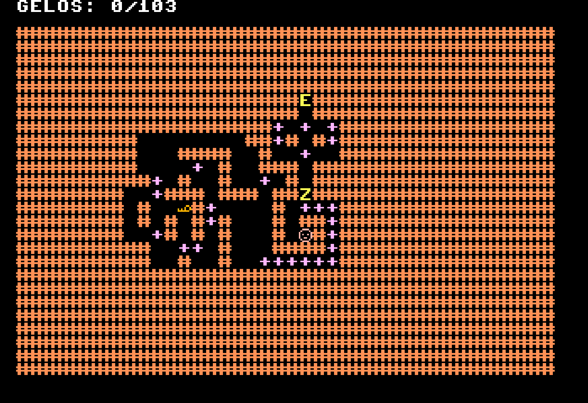

# Thin Ice Assembly Game — ICMC Processor (FPGA)

Este projeto é uma implementação do minigame Thin Ice do Club Penguin, inteiramente desenvolvido em linguagem de montagem (assembly) para o Processador do ICMC.
Além do jogo, propusemos e implementamos uma nova instrução no processador, a operação NAND lógico, estendendo a arquitetura original do processador.

## Descrição do jogo
O jogo consiste em mover um personagem por um tabuleiro de gelo, onde cada bloco de gelo quebra após o personagem passar por ele. O objetivo é alcançar o destino final passando por todos os blocos sem cair na água.

### Funcionalidades:
- Movimentação em quatro direções (WASD).
- Registro de blocos já visitados.
- Detecção de vitória e derrota.
- Atualização visual do estado do tabuleiro.
- Sprites feitos especialmente para o jogo.
- Facilidade em criar um novo mapa

### Como criar um mapa
Para-se criar um novo mapa, basta desenhar uma pixel art 40x28 e salvá-lo em formato PNG, respeitando a seguinte tabela de cores:
- Preto => Parede 
- Branco => Gelo (derrete após um jogador passar por sua posição)
- Cinza => Gelo duplo (quando o jogador passar em cima, uma camada derrete e vira um gelo simples)
- Verde => Posição de início do jogador
- Vermelho => Posição de destino do Jogador
- Amarelo => Chave (abre o portão para o jogador) 
- Rosa => Portão (bloqueia a passagem até que seja aberto)
Após ter os mapas desenhados, e possível gerar o código em assembly com todos os mapas do jogo por meio do gerador_de mapa.py.

### Como montar o jogo
Criamos uma ferramenta que permite usar #include {nome do arquivo} no código, para modularizarmos o nosso programa.
Para montar um jogo finalizado, basta rodar: 
´´´
python montaJogo.py main.asm jogo.asm
´´´
Após isso, pode-se usar o montador do simulador para gerar um 'cpuram.mif', que será o código colocado na placa FPGA.

### Como criar sprites
Caso queira alterar um sprite do jogo, basta criar uma pixel art 8x8 e salvar em um arquivo png.
Então pode-se rodar: 
´´´
python png_to_mif.py {nome do arquivo de imagem} {caracter a ser sibstituido}
´´´
E o programa imprimirá no terminal o trecho de código que deve-se substituir no charmap.mif.

## Vídeo explicativo do jogo

## Alunos
- Dante Brito Lourenço - 15447326
- Fernando Valentim Torres - 15452340
- Pedro Lunkes Villela - 15484287
- Pedro Henrique de Sousa Prestes - 15507819
